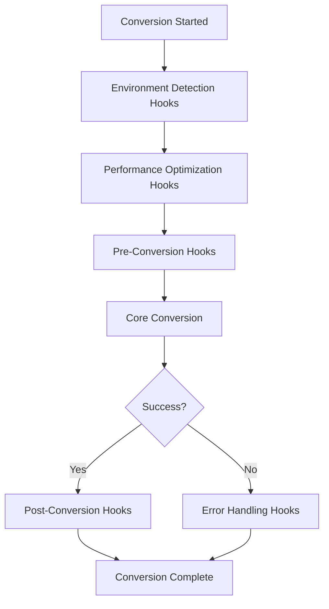

# PyForge CLI Extension Developer Guide

This guide provides comprehensive documentation for developing extensions for PyForge CLI. Extensions allow you to add new functionality, provide environment-specific optimizations, and integrate with external services.

## Table of Contents

1. [Overview](#overview)
2. [Getting Started](#getting-started)
3. [Extension Architecture](#extension-architecture)
4. [Creating Your First Extension](#creating-your-first-extension)
5. [BaseExtension API Reference](#baseextension-api-reference)
6. [Hook System](#hook-system)
7. [Best Practices](#best-practices)
8. [Example Extensions](#example-extensions)
9. [Testing Your Extension](#testing-your-extension)
10. [Publishing Your Extension](#publishing-your-extension)
11. [Troubleshooting](#troubleshooting)

## Overview

PyForge CLI's extension system allows developers to:

- **Add new functionality** to the CLI tool
- **Provide environment-specific optimizations** (e.g., Databricks, cloud platforms)
- **Integrate with external services** and APIs
- **Enhance existing commands** with additional options
- **Hook into the conversion pipeline** for custom processing

Extensions are discovered automatically through Python entry points and are loaded dynamically based on availability and dependencies.

### Key Features

- **Plugin Discovery**: Automatic discovery through Python entry points
- **Lifecycle Management**: Controlled initialization and cleanup
- **Hook System**: Extensible hooks for core functionality
- **Environment Detection**: Automatic environment adaptation
- **Graceful Degradation**: Extensions fail gracefully without breaking core functionality
- **Performance Optimization**: Environment-specific performance enhancements

## Getting Started

### Prerequisites

- Python 3.8+ (Python 3.10.12 recommended for Databricks/PySpark extensions)
- PyForge CLI installed in development mode
- Basic understanding of Python packaging
- Java 8 or 11 (for PySpark-based extensions)

### Development Environment Setup

1. **Clone PyForge CLI for development:**
   ```bash
   git clone https://github.com/Py-Forge-Cli/PyForge-CLI.git
   cd PyForge-CLI
   ```

2. **Install in development mode:**
   ```bash
   pip install -e ".[dev]"
   ```

3. **Verify installation:**
   ```bash
   pyforge --version
   ```

### Extension Project Structure

Create a new Python project with the following structure:

```
my-pyforge-extension/
├── pyproject.toml
├── README.md
├── src/
│   └── my_extension/
│       ├── __init__.py
│       ├── extension.py
│       └── utils.py
├── tests/
│   ├── __init__.py
│   └── test_extension.py
└── examples/
    └── usage_example.py
```

## Extension Architecture

### Component Overview

```mermaid
graph TD
    A[PyForge CLI] --> B[Plugin Discovery]
    B --> C[Extension Registry]
    C --> D[Extension Lifecycle]
    D --> E[Hook System]
    E --> F[Your Extension]
    
    F --> G[is_available()]
    F --> H[initialize()]
    F --> I[Hook Methods]
    F --> J[Custom Commands]
```

### Extension Lifecycle

1. **Discovery**: Extensions are discovered through entry points
2. **Availability Check**: `is_available()` method determines if extension can run
3. **Initialization**: `initialize()` method sets up the extension
4. **Registration**: Extension is registered with the plugin system
5. **Hook Registration**: Hook methods are registered for pipeline integration
6. **Cleanup**: `cleanup()` method is called on shutdown

## Creating Your First Extension

### Step 1: Create the Extension Class

Create `src/my_extension/extension.py`:

```python
from pyforge_cli.extensions.base import BaseExtension
from typing import Dict, Any, Optional
from pathlib import Path

class MyExtension(BaseExtension):
    """Example extension for PyForge CLI."""
    
    def __init__(self):
        super().__init__()
        self.name = "my_extension"
        self.version = "1.0.0"
        self.description = "Example extension demonstrating PyForge CLI capabilities"
    
    def is_available(self) -> bool:
        """Check if extension dependencies are available."""
        try:
            # Check for required dependencies
            import requests  # Example dependency
            return True
        except ImportError:
            return False
    
    def initialize(self) -> bool:
        """Initialize the extension."""
        if not self.is_available():
            return False
        
        try:
            # Perform initialization tasks
            self.initialized = True
            print(f"✅ {self.name} extension initialized successfully")
            return True
        except Exception as e:
            print(f"❌ Failed to initialize {self.name}: {e}")
            return False
    
    def cleanup(self) -> None:
        """Clean up extension resources."""
        super().cleanup()
        print(f"🧹 {self.name} extension cleaned up")
    
    def get_commands(self) -> Dict[str, Any]:
        """Add custom CLI commands."""
        return {
            'my-command': self.my_custom_command
        }
    
    def my_custom_command(self, *args, **kwargs):
        """Custom CLI command implementation."""
        print(f"Executing custom command from {self.name}")
        return True
    
    def hook_pre_conversion(self, input_file: Path, output_file: Path, options: Dict[str, Any]) -> Optional[Dict[str, Any]]:
        """Hook called before conversion starts."""
        print(f"🔄 Pre-conversion hook: {input_file} -> {output_file}")
        
        # Example: Add custom metadata
        options['extension_metadata'] = {
            'processed_by': self.name,
            'version': self.version
        }
        
        return options
    
    def hook_post_conversion(self, input_file: Path, output_file: Path, options: Dict[str, Any], success: bool) -> None:
        """Hook called after conversion completes."""
        status = "✅" if success else "❌"
        print(f"{status} Post-conversion hook: {input_file} -> {output_file}")
```

### Step 2: Configure Entry Points

Create or update `pyproject.toml`:

```toml
[build-system]
requires = ["setuptools>=64", "setuptools-scm>=8"]
build-backend = "setuptools.build_meta"

[project]
name = "my-pyforge-extension"
version = "1.0.0"
description = "Example PyForge CLI extension"
authors = [{name = "Your Name", email = "your.email@example.com"}]
dependencies = [
    "pyforge-cli>=0.5.0",
    "requests>=2.25.0"
]

[project.optional-dependencies]
dev = [
    "pytest>=7.0.0",
    "pytest-cov>=4.0.0"
]

# For PySpark-based extensions (e.g., Databricks)
pyspark = [
    "pyspark==3.5.0",  # Match Databricks Runtime 14.3 LTS
    "delta-spark==3.1.0",
    "py4j==0.10.9.7"
]

# Entry point for PyForge CLI extension discovery
[project.entry-points."pyforge.extensions"]
my_extension = "my_extension.extension:MyExtension"
```

### Step 3: Test Your Extension

Create `tests/test_extension.py`:

```python
import pytest
from my_extension.extension import MyExtension

def test_extension_creation():
    """Test extension can be created."""
    ext = MyExtension()
    assert ext.name == "my_extension"
    assert ext.version == "1.0.0"

def test_extension_availability():
    """Test extension availability check."""
    ext = MyExtension()
    assert isinstance(ext.is_available(), bool)

def test_extension_initialization():
    """Test extension initialization."""
    ext = MyExtension()
    if ext.is_available():
        assert ext.initialize() == True
        assert ext.initialized == True

def test_extension_hooks():
    """Test extension hook methods."""
    ext = MyExtension()
    
    # Test pre-conversion hook
    from pathlib import Path
    input_file = Path("test.txt")
    output_file = Path("test.parquet")
    options = {}
    
    result = ext.hook_pre_conversion(input_file, output_file, options)
    assert result is not None
    assert 'extension_metadata' in result

def test_extension_commands():
    """Test custom commands."""
    ext = MyExtension()
    commands = ext.get_commands()
    assert 'my-command' in commands
    assert callable(commands['my-command'])
```

## BaseExtension API Reference

### Abstract Methods (Must Implement)

#### `is_available() -> bool`
Checks if the extension can be used in the current environment.

**Returns:**
- `bool`: True if extension dependencies are available

**Example:**
```python
def is_available(self) -> bool:
    try:
        import databricks_sdk
        return True
    except ImportError:
        return False
```

#### `initialize() -> bool`
Initializes the extension when it's loaded.

**Returns:**
- `bool`: True if initialization successful

**Example:**
```python
def initialize(self) -> bool:
    if not self.is_available():
        return False
    
    try:
        self.client = SomeAPIClient()
        self.initialized = True
        return True
    except Exception:
        return False
```

### Optional Methods (Can Override)

#### `cleanup() -> None`
Called when extension is unloaded or application shuts down.

#### `get_commands() -> Dict[str, Any]`
Returns additional CLI commands provided by the extension.

#### `enhance_convert_command(options: Dict[str, Any]) -> Dict[str, Any]`
Enhances the convert command with extension-specific options.

### Hook Methods

#### `hook_pre_conversion(input_file, output_file, options) -> Optional[Dict[str, Any]]`
Called before conversion starts. Can modify conversion options.

#### `hook_post_conversion(input_file, output_file, options, success) -> None`
Called after conversion completes.

#### `hook_error_handling(error, context) -> bool`
Called when an error occurs. Return True if error was handled.

#### `hook_environment_detection() -> Dict[str, Any]`
Called to detect environment-specific information.

#### `hook_performance_optimization(operation, options) -> Dict[str, Any]`
Called to apply performance optimizations.

## Hook System

The hook system allows extensions to integrate deeply with PyForge CLI's core functionality.

### Available Hooks

1. **Pre-Conversion Hook**: Modify options before conversion
2. **Post-Conversion Hook**: Handle results after conversion
3. **Error Handling Hook**: Custom error handling
4. **Environment Detection Hook**: Detect environment specifics
5. **Performance Optimization Hook**: Apply optimizations

### Hook Execution Order



### Hook Best Practices

1. **Keep hooks fast**: Hooks are called for every operation
2. **Handle errors gracefully**: Don't let hook errors break core functionality
3. **Return appropriate values**: Follow the hook method signatures
4. **Log appropriately**: Use structured logging for debugging
5. **Respect existing options**: Don't override user-provided options unnecessarily

## Best Practices

### 1. Error Handling

Always handle errors gracefully:

```python
def initialize(self) -> bool:
    try:
        # Initialization code
        return True
    except Exception as e:
        self.logger.error(f"Extension initialization failed: {e}")
        return False
```

### 2. Dependency Management

Check dependencies in `is_available()`:

```python
def is_available(self) -> bool:
    try:
        import required_package
        # Check version if needed
        if hasattr(required_package, '__version__'):
            version = required_package.__version__
            # Version checking logic
        return True
    except ImportError:
        return False
```

### 3. Environment Detection

Detect environment specifics:

```python
def hook_environment_detection(self) -> Dict[str, Any]:
    env_info = {}
    
    # Check for cloud environment
    if os.environ.get('DATABRICKS_RUNTIME_VERSION'):
        env_info['platform'] = 'databricks'
        env_info['serverless'] = 'serverless' in os.environ.get('DATABRICKS_RUNTIME_VERSION', '')
    
    return env_info
```

### 4. Performance Optimization

Apply environment-specific optimizations:

```python
def hook_performance_optimization(self, operation: str, options: Dict[str, Any]) -> Dict[str, Any]:
    if operation == 'convert' and self.is_serverless_environment():
        # Use PySpark for large datasets in serverless
        options['use_pyspark'] = True
        options['partition_size'] = '128MB'
    
    return options
```

### 5. Logging

Use structured logging:

```python
import logging

class MyExtension(BaseExtension):
    def __init__(self):
        super().__init__()
        self.logger = logging.getLogger(f"pyforge.extensions.{self.name}")
    
    def initialize(self) -> bool:
        self.logger.info("Initializing extension")
        # ... initialization code
        self.logger.info("Extension initialized successfully")
        return True
```

### 6. Configuration

Support configuration:

```python
def __init__(self):
    super().__init__()
    self.config = self.load_config()

def load_config(self) -> Dict[str, Any]:
    """Load extension configuration."""
    config_file = Path.home() / '.pyforge' / f'{self.name}.json'
    if config_file.exists():
        with open(config_file) as f:
            return json.load(f)
    return {}
```

## Example Extensions

### Example 1: Databricks Extension

```python
from pyforge_cli.extensions.base import BaseExtension
from typing import Dict, Any, Optional
from pathlib import Path
import os

class DatabricksExtension(BaseExtension):
    """Databricks integration extension for PyForge CLI."""
    
    def __init__(self):
        super().__init__()
        self.name = "databricks"
        self.version = "1.0.0"
        self.description = "Databricks integration with Unity Catalog and PySpark optimization"
        self.pyspark_available = False
    
    def is_available(self) -> bool:
        """Check if running in Databricks environment."""
        return 'DATABRICKS_RUNTIME_VERSION' in os.environ
    
    def initialize(self) -> bool:
        """Initialize Databricks-specific functionality."""
        if not self.is_available():
            return False
        
        try:
            # Check PySpark availability
            import pyspark
            self.pyspark_available = True
            
            # Initialize Databricks SDK if available
            try:
                from databricks.sdk import WorkspaceClient
                self.workspace_client = WorkspaceClient()
            except ImportError:
                self.workspace_client = None
            
            self.initialized = True
            return True
        except Exception as e:
            self.logger.error(f"Databricks extension initialization failed: {e}")
            return False
    
    def hook_environment_detection(self) -> Dict[str, Any]:
        """Detect Databricks environment specifics."""
        env_info = {}
        
        if self.is_available():
            runtime_version = os.environ.get('DATABRICKS_RUNTIME_VERSION', '')
            env_info.update({
                'platform': 'databricks',
                'runtime_version': runtime_version,
                'serverless': 'serverless' in runtime_version.lower(),
                'pyspark_available': self.pyspark_available
            })
        
        return env_info
    
    def hook_performance_optimization(self, operation: str, options: Dict[str, Any]) -> Dict[str, Any]:
        """Apply Databricks-specific optimizations."""
        if operation == 'convert' and self.pyspark_available:
            env_info = self.hook_environment_detection()
            
            if env_info.get('serverless'):
                # Optimize for serverless environment
                options.update({
                    'use_pyspark': True,
                    'spark_config': {
                        'spark.sql.adaptive.enabled': 'true',
                        'spark.sql.adaptive.coalescePartitions.enabled': 'true'
                    }
                })
        
        return options
    
    def get_commands(self) -> Dict[str, Any]:
        """Add Databricks-specific commands."""
        return {
            'install-datasets': self.install_datasets_to_volume,
            'list-volumes': self.list_unity_catalog_volumes
        }
    
    def install_datasets_to_volume(self, volume_path: str = None):
        """Install sample datasets to Unity Catalog Volume."""
        print(f"Installing datasets to volume: {volume_path}")
        # Implementation here
    
    def list_unity_catalog_volumes(self):
        """List available Unity Catalog Volumes."""
        if self.workspace_client:
            print("Listing Unity Catalog Volumes...")
            # Implementation here
        else:
            print("Databricks SDK not available")
```

### Example 2: Cloud Storage Extension

```python
class CloudStorageExtension(BaseExtension):
    """Cloud storage integration extension."""
    
    def __init__(self):
        super().__init__()
        self.name = "cloud_storage"
        self.version = "1.0.0"
        self.description = "Cloud storage integration (AWS S3, Azure Blob, GCS)"
    
    def is_available(self) -> bool:
        """Check if cloud storage libraries are available."""
        try:
            import boto3  # AWS
            return True
        except ImportError:
            try:
                import azure.storage.blob  # Azure
                return True
            except ImportError:
                try:
                    import google.cloud.storage  # GCS
                    return True
                except ImportError:
                    return False
    
    def initialize(self) -> bool:
        """Initialize cloud storage clients."""
        if not self.is_available():
            return False
        
        try:
            # Initialize available cloud clients
            self.clients = {}
            
            try:
                import boto3
                self.clients['s3'] = boto3.client('s3')
            except:
                pass
                
            # Similar for other cloud providers
            
            self.initialized = True
            return True
        except Exception as e:
            return False
    
    def hook_pre_conversion(self, input_file: Path, output_file: Path, options: Dict[str, Any]) -> Optional[Dict[str, Any]]:
        """Handle cloud storage paths."""
        input_str = str(input_file)
        output_str = str(output_file)
        
        # Check for cloud storage URLs
        if input_str.startswith(('s3://', 'gs://', 'abfs://')):
            # Download from cloud storage
            local_input = self.download_from_cloud(input_str)
            options['cloud_input'] = input_str
            options['local_input'] = local_input
        
        if output_str.startswith(('s3://', 'gs://', 'abfs://')):
            # Prepare for cloud upload
            options['cloud_output'] = output_str
            options['local_output'] = self.get_temp_output_path()
        
        return options
    
    def hook_post_conversion(self, input_file: Path, output_file: Path, options: Dict[str, Any], success: bool) -> None:
        """Upload results to cloud storage if needed."""
        if success and 'cloud_output' in options:
            self.upload_to_cloud(options['local_output'], options['cloud_output'])
        
        # Cleanup temporary files
        if 'local_input' in options:
            Path(options['local_input']).unlink(missing_ok=True)
        if 'local_output' in options:
            Path(options['local_output']).unlink(missing_ok=True)
```

## Testing Your Extension

### Unit Testing

Create comprehensive unit tests:

```python
import pytest
import tempfile
from pathlib import Path
from unittest.mock import Mock, patch

from my_extension.extension import MyExtension

class TestMyExtension:
    
    def setup_method(self):
        """Set up test fixtures."""
        self.extension = MyExtension()
    
    def test_extension_metadata(self):
        """Test extension metadata."""
        assert self.extension.name == "my_extension"
        assert self.extension.version == "1.0.0"
        assert isinstance(self.extension.description, str)
    
    def test_availability_check(self):
        """Test availability check."""
        is_available = self.extension.is_available()
        assert isinstance(is_available, bool)
    
    @patch('my_extension.extension.requests')
    def test_availability_with_missing_dependency(self, mock_requests):
        """Test availability when dependency is missing."""
        mock_requests.side_effect = ImportError("requests not found")
        
        # Should handle import error gracefully
        is_available = self.extension.is_available()
        assert is_available == False
    
    def test_initialization(self):
        """Test extension initialization."""
        if self.extension.is_available():
            result = self.extension.initialize()
            assert result == True
            assert self.extension.initialized == True
    
    def test_hook_pre_conversion(self):
        """Test pre-conversion hook."""
        input_file = Path("test.csv")
        output_file = Path("test.parquet")
        options = {"format": "parquet"}
        
        result = self.extension.hook_pre_conversion(input_file, output_file, options)
        
        assert result is not None
        assert "extension_metadata" in result
        assert result["extension_metadata"]["processed_by"] == self.extension.name
    
    def test_hook_post_conversion(self):
        """Test post-conversion hook."""
        input_file = Path("test.csv")
        output_file = Path("test.parquet")
        options = {}
        
        # Should not raise any exceptions
        self.extension.hook_post_conversion(input_file, output_file, options, True)
        self.extension.hook_post_conversion(input_file, output_file, options, False)
    
    def test_custom_commands(self):
        """Test custom commands."""
        commands = self.extension.get_commands()
        assert isinstance(commands, dict)
        assert "my-command" in commands
        
        # Test command execution
        result = commands["my-command"]()
        assert result == True
    
    def test_cleanup(self):
        """Test extension cleanup."""
        self.extension.initialized = True
        self.extension.cleanup()
        assert self.extension.initialized == False
```

### Integration Testing

Test with PyForge CLI:

```python
import subprocess
import json
from pathlib import Path

def test_extension_integration():
    """Test extension works with PyForge CLI."""
    
    # Test that extension is discovered
    result = subprocess.run(
        ["pyforge", "--list-extensions"],
        capture_output=True,
        text=True
    )
    
    assert result.returncode == 0
    assert "my_extension" in result.stdout
    
    # Test custom command
    result = subprocess.run(
        ["pyforge", "my-command"],
        capture_output=True,
        text=True
    )
    
    assert result.returncode == 0

def test_extension_hooks():
    """Test extension hooks are called during conversion."""
    
    # Create test file
    test_input = Path("test_input.csv")
    test_output = Path("test_output.parquet")
    
    test_input.write_text("id,name\n1,test\n2,example")
    
    try:
        # Run conversion with verbose output
        result = subprocess.run(
            ["pyforge", "convert", str(test_input), str(test_output), "--verbose"],
            capture_output=True,
            text=True
        )
        
        # Check that hook messages appear in output
        assert "Pre-conversion hook" in result.stdout or result.stderr
        assert "Post-conversion hook" in result.stdout or result.stderr
        
    finally:
        # Cleanup
        test_input.unlink(missing_ok=True)
        test_output.unlink(missing_ok=True)
```

### Testing in Isolated Environment

```bash
# Create isolated test environment
python -m venv test_env
source test_env/bin/activate  # On Windows: test_env\Scripts\activate

# Install your extension
pip install -e .

# Run tests
pytest tests/ -v

# Test CLI integration
pyforge --list-extensions
pyforge convert test.csv test.parquet --verbose
```

## Publishing Your Extension

### 1. Prepare for Distribution

Update `pyproject.toml` with complete metadata:

```toml
[project]
name = "my-pyforge-extension"
version = "1.0.0"
description = "Example PyForge CLI extension"
readme = "README.md"
license = {text = "MIT"}
authors = [{name = "Your Name", email = "your.email@example.com"}]
keywords = ["pyforge", "cli", "extension", "data"]
classifiers = [
    "Development Status :: 4 - Beta",
    "Intended Audience :: Developers",
    "License :: OSI Approved :: MIT License",
    "Programming Language :: Python :: 3",
    "Programming Language :: Python :: 3.8",
    "Programming Language :: Python :: 3.9",
    "Programming Language :: Python :: 3.10",
    "Programming Language :: Python :: 3.11",
    "Programming Language :: Python :: 3.12",
]
dependencies = [
    "pyforge-cli>=0.5.0",
]

[project.urls]
Homepage = "https://github.com/yourusername/my-pyforge-extension"
Repository = "https://github.com/yourusername/my-pyforge-extension"
Issues = "https://github.com/yourusername/my-pyforge-extension/issues"
Documentation = "https://my-pyforge-extension.readthedocs.io"

[project.entry-points."pyforge.extensions"]
my_extension = "my_extension.extension:MyExtension"
```

### 2. Create Documentation

Create comprehensive documentation:

- `README.md`: Overview and quick start
- `CHANGELOG.md`: Version history
- `docs/`: Detailed documentation
- Code examples and tutorials

### 3. Publish to PyPI

```bash
# Build distribution
python -m build

# Upload to PyPI (use TestPyPI first)
python -m twine upload --repository testpypi dist/*

# Install and test
pip install --index-url https://test.pypi.org/simple/ my-pyforge-extension

# Upload to production PyPI
python -m twine upload dist/*
```

### 4. Register with PyForge CLI

Create a pull request to add your extension to the official PyForge CLI extension registry:

```markdown
## Extension Registration

- **Name**: my-pyforge-extension
- **Description**: Example extension demonstrating PyForge CLI capabilities
- **PyPI Package**: https://pypi.org/project/my-pyforge-extension/
- **Documentation**: https://my-pyforge-extension.readthedocs.io
- **Source Code**: https://github.com/yourusername/my-pyforge-extension
- **License**: MIT
- **Maintainer**: Your Name (your.email@example.com)
```

## Troubleshooting

### Common Issues

#### Extension Not Discovered

**Problem**: Extension doesn't appear in `pyforge --list-extensions`

**Solutions**:
1. Check entry point configuration in `pyproject.toml`
2. Verify package is installed: `pip list | grep your-extension`
3. Check for import errors: `python -c "from your_extension.extension import YourExtension"`

#### Import Errors

**Problem**: Extension fails to import

**Solutions**:
1. Check all dependencies are installed
2. Verify Python path includes your extension
3. Use absolute imports in extension code

#### Initialization Failures

**Problem**: Extension `is_available()` returns False

**Solutions**:
1. Check dependency availability
2. Verify environment conditions
3. Add debug logging to `is_available()` method

#### Hook Not Called

**Problem**: Hook methods are not being executed

**Solutions**:
1. Verify extension is initialized successfully
2. Check hook method signatures match BaseExtension
3. Ensure hook returns appropriate values

### Debug Mode

Enable debug logging:

```python
import logging
logging.basicConfig(level=logging.DEBUG)

# Run PyForge CLI with debug output
pyforge convert test.csv test.parquet --verbose
```

### Testing with Different Environments

Test your extension in different environments:

```bash
# Test with different Python versions
python3.8 -m pytest tests/
python3.9 -m pytest tests/
python3.10 -m pytest tests/

# Test with minimal dependencies
pip install --no-deps your-extension
python -c "from your_extension.extension import YourExtension; print(YourExtension().is_available())"
```

### Performance Profiling

Profile your extension:

```python
import cProfile
import pstats

def profile_extension():
    extension = YourExtension()
    extension.initialize()
    
    # Profile hook performance
    pr = cProfile.Profile()
    pr.enable()
    
    # Run hook
    extension.hook_pre_conversion(Path("test.csv"), Path("test.parquet"), {})
    
    pr.disable()
    stats = pstats.Stats(pr)
    stats.sort_stats('cumulative')
    stats.print_stats()

profile_extension()
```

## Additional Resources

- [PyForge CLI Documentation](https://py-forge-cli.github.io/PyForge-CLI/)
- [Extension Examples Repository](https://github.com/Py-Forge-Cli/extension-examples)
- [Community Forum](https://github.com/Py-Forge-Cli/PyForge-CLI/discussions)
- [Issue Tracker](https://github.com/Py-Forge-Cli/PyForge-CLI/issues)

## Contributing

We welcome contributions to improve this guide! Please:

1. Fork the repository
2. Create a feature branch
3. Make your improvements
4. Add examples and tests
5. Submit a pull request

## License

This documentation is part of PyForge CLI and is licensed under the MIT License.